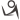

[  GitHub Homepage](https://github.com/zheyi420)  

[  Dev-Wiki Repo](https://github.com/zheyi420/Dev-Wiki)  

[  博客园](https://www.cnblogs.com/zheyi420/)  

# WebGIS Dev Repo

- ✨ [GeoDataVis](https://zheyi420.github.io/GeoDataVis/) - View map services and geographic data files on the web. [Based on CesiumJS]

- 📦 [Cesium Demo](https://zheyi420.github.io/cesium-demo/) - A WebGIS demo built with Vue.js(3.x), Vite and CesiumJS.

- ⚠️ [SmartMapX WebGIS Examples](https://zheyi420.github.io/smartmapx-webgis-examples/) - WebGIS examples for customer business dev.

- ⚠️ [SmartMapX GeoJSON Editor](https://zheyi420.github.io/smartmapx.geojson.io/) - Implement geojson.io with SmartMapX JS.
